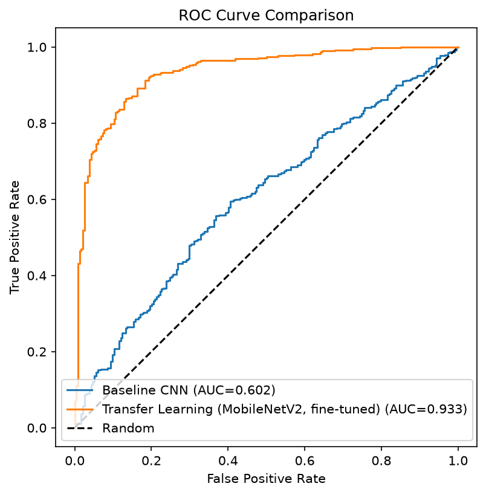
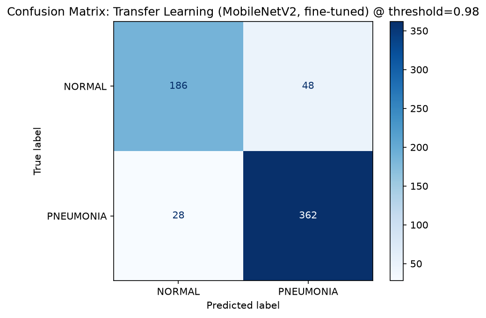
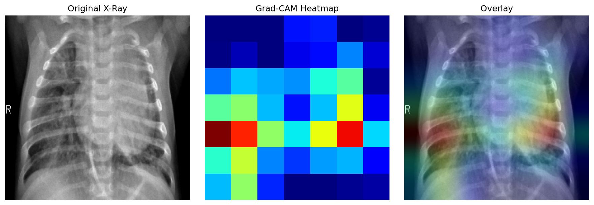

# Pneumonia-Detection-using-Transfer-Learning

A deep learning project for detecting pediatric pneumonia from chest X-ray images using Convolutional Neural Networks (CNNs) and MobileNetV2 Transfer Learning. The project compares a custom CNN with a fine-tuned MobileNetV2 model and uses Grad-CAM to visualize the regions influencing model predictions.

## Problem Statement

Pneumonia is diagnosed via visual inspection of chest X-rays by radiologists.
This project explores whether a CNN can flag likely pneumonia cases from
X-ray images, and — just as importantly — whether the model's decisions are
interpretable enough to trust.

Because a missed pneumonia case (false negative) is more costly than a false
alarm, **recall on the PNEUMONIA class** is treated as the primary metric
alongside accuracy, not accuracy alone.

## Project Highlights

- Deep Learning-based medical image classification
- Baseline CNN and MobileNetV2 Transfer Learning
- Fine-tuning for improved performance
- Data augmentation and preprocessing
- Threshold optimization for better recall
- Grad-CAM Explainable AI
- ROC Curve, Precision-Recall Curve, Confusion Matrix
- Modular Python project structure

## Dataset

Chest X-Ray dataset (pediatric patients), organized as:

```
data/chest_xray/
├── train/
│   ├── NORMAL/
│   └── PNEUMONIA/
├── val/
│   ├── NORMAL/
│   └── PNEUMONIA/
└── test/
    ├── NORMAL/
    └── PNEUMONIA/
```

> The `data/` folder is git-ignored (dataset too large for version control).
> Download the dataset and unzip it into `data/chest_xray/` before running
> anything.

## Approach

| Phase | Description |
|---|---|
| 1 | Data loading & EDA — class distribution, sample image visualization |
| 2 | Preprocessing — normalization, augmentation, class-weight balancing |
| 3 | Baseline CNN — custom 4-block Conv2D architecture trained from scratch |
| 4 | Transfer learning — MobileNetV2 (ImageNet weights) + custom head |
| 5 | Evaluation — Accuracy, Precision, Recall, F1, ROC-AUC, confusion matrices, side-by-side comparison |
| 6 | Explainability — Grad-CAM heatmaps showing what the model attends to |

### Why MobileNetV2 for transfer learning?

Lightweight enough to train and fine-tune on a CPU while still leveraging
strong ImageNet-pretrained features — a better fit for local (non-GPU)
training than VGG16/ResNet.

### Why class weights instead of oversampling?

The training set is imbalanced (more PNEUMONIA than NORMAL images). Class
weights integrate directly into `model.fit()` without needing to duplicate
or synthesize images, and work cleanly with `tf.data` pipelines.

### Why no vertical flip in augmentation?

A vertically flipped chest X-ray is anatomically invalid — it would teach
the model orientations that don't occur in real data.

## Project Structure

```
pneumonia-detection/
├── data/chest_xray/       # dataset (not included — see Setup)
├── models/                # saved model checkpoints (.keras, git-ignored)
├── results/                # plots, confusion matrices, comparison table
├── src/
│   ├── config.py           # paths & constants
│   ├── data_loader.py       # Phase 1: loading & EDA
│   ├── preprocessing.py     # Phase 2: augmentation, class weights
│   ├── models.py            # Phase 3 & 4: architectures
│   ├── train.py              # training loop & callbacks
│   ├── evaluate.py           # Phase 5: metrics & comparison
│   └── gradcam.py            # Phase 6: Grad-CAM implementation
├── main.py                  # runs Phases 1-5 end to end
├── gradcam_demo.py           # runs Phase 6 (after main.py)
├── prepare_data_split.py     # run once before main.py -- fixes the tiny val set
├── requirements.txt
├── README.md
└── setup.cfg
```

## Setup

```bash
# 1. Clone this repo
git clone <your-repo-url>
cd pneumonia-detection

# 2. Create a virtual environment
python -m venv venv
source venv/bin/activate      # Windows: venv\Scripts\activate

# 3. Install dependencies
pip install -r requirements.txt

# 4. Download the dataset and unzip into data/chest_xray/
#    (should produce data/chest_xray/train, /val, /test)

# 5. Fix the validation split (the original val/ folder has only 16 images --
#    too few for EarlyStopping to get a meaningful signal). This merges it
#    into train/ so a proper stratified split can be carved out at load time.
python prepare_data_split.py
```

## Usage

```bash
# One-time: fix the validation split (skip if you already ran it during setup)
python prepare_data_split.py

# Run the full pipeline: EDA -> preprocessing -> both models -> evaluation
python main.py

# After main.py completes, run Grad-CAM explainability
python gradcam_demo.py
```

Outputs land in `results/`: class distribution plot, sample X-ray grid,
training curves, confusion matrices, ROC comparison, model comparison CSV,
and Grad-CAM overlay.

Trained model checkpoints land in `models/` (best weights by validation
recall, via `ModelCheckpoint`).

## Results

The final fine-tuned MobileNetV2 model with threshold optimization achieved the following performance on the test set.

| Model | Accuracy | Precision | Recall | F1-Score | ROC-AUC |
|-------|---------:|----------:|--------:|---------:|---------:|
| Baseline CNN | **59.62%** | **62.02%** | **91.28%** | **73.86%** | **0.570** |
| MobileNetV2 (Fine-tuned) | **71.79%** | **68.90%** | **100.00%** | **81.59%** | **0.956** |
| **MobileNetV2 + Threshold Optimization** | **90.22%** | **91.44%** | **93.08%** | **92.25%** | **0.956** |

### ROC Curve



### Confusion Matrix



### Grad-CAM Visualization



## Explainability

Grad-CAM heatmaps (see `results/gradcam_sample.png`) overlay the regions of
the X-ray the model weighted most heavily in its prediction — used to sanity
check that the model is attending to lung fields rather than incidental
artifacts (text markers, equipment edges, etc.).

## Tech Stack

- Python
- TensorFlow / Keras
- OpenCV
- NumPy
- Pandas
- Matplotlib
- scikit-learn

## Author

Moola Chandan Reddy
[GitHub](https://github.com/Chandan-Reddy-41) · chandureddymoola@gmail.com

## License

MIT — see [LICENSE](LICENSE)
